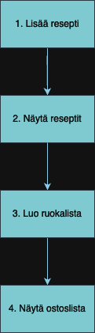

# Ruokalistasuunnittelija

## 📋 Kuvaus
**Ruokalistasuunnittelija / meal-planner** on yksinkertainen tekstipohjainen sovellus, joka auttaa käyttäjää suunnittelemaan viikoittaisen ruokalistan, lisäämään reseptejä ja luomaan ostoslistan. Sovellus on kirjoitettu Pythonilla ja tarjoaa käyttäjäystävällisen tavan hallita ruokailusuunnitelmia.

# Vuokaavio 



## 🌟 Ominaisuudet
- **Lisää resepti**: Käyttäjä voi lisätä uuden reseptin nimeä ja ainesosia käyttäen.
- **Näytä reseptit**: Näytä kaikki tallennetut reseptit ja niiden ainesosat.
- **Luo ruokalista**: Luo viikoittainen ruokalista valitsemalla reseptejä eri päiville.
- **Näytä ostoslista**: Generoi ostoslista valitun ruokalistan ainesosien perusteella.

# 🥗 Käyttäohjeet
Valitse toiminto:
1. Lisää resepti
2. Näytä reseptit
3. Luo ruokalista
4. Näytä ostoslista
5. Lopeta

Valitse 1 ja seuraa ohjeita.
Syötä reseptin nimi ja ainesosat pilkulla erotettuna.
Esimerkki: Spagetti Bolognese, spagetti, jauheliha, tomaattikastike, sipuli, valkosipuli

Valitse 2 nähdäksesi kaikki tallennetut reseptit.

Valitse 3 ja syötä viikonpäivät sekä valitse niille reseptit.
Esimerkki: maanantai, Spagetti Bolognese

Valitse 4 nähdäksesi ostoslistan, joka perustuu luomaasi ruokalistaan.

Valitse 5 lopettaaksesi ohjelman.

## 🛠️ Teknologiat
- **Kieli**: Python
- **Ympäristö**: Tekstipohjainen käyttöliittymä

## 🔮 Tulevat ominaisuudet
Reseptien muokkaaminen: Mahdollisuus muokata jo lisättyjä reseptejä.
Reseptien poistaminen: Mahdollisuus poistaa reseptejä.
Tarkemmat ostoslistat: Kategorisoi ainesosat, kuten "vihannekset", "liha", jne.

## 📞 Yhteystiedot
Nimi: Sara Sayeed & Ruth Tessema

## 🚀 Asennus
Seuraa näitä ohjeita asentaaksesi ja käynnistääksesi sovelluksen:

```bash

### Käyttöohjeet (Ohjelman suorittaminen ilman GitHubia)
1. Lataa ohjelman ZIP-tiedosto GitHubista ja pura se haluamaasi kansioon.

tai

1. Kloonaa repositorio paikalliselle koneellesi:
    sh
    git clone https://github.com/ruthtessemaa/ohjelmointi.git


3. Navigoi purettuun/kloonattuun kansioon:
    sh
    cd /Users/ruth/Documents/GitHub/ohjelmointi
    

# Suorita Ohjelma
/usr/local/bin/python3 /Users/ruth/Documents/GitHub/ohjelmointi/main.py